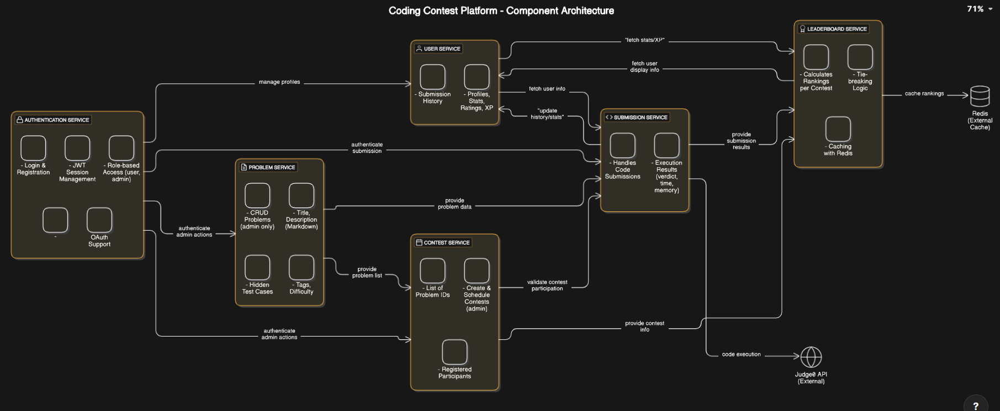

# 🥋 Dojo – Coding Contest Platform

Dojo is a full-stack web platform designed for organizing and participating in coding contests. Inspired by platforms like Codeforces and LeetCode, it supports features like problem creation, real-time submissions, leaderboards, and user progress tracking.

---

## 🚀 Features

- 🔐 Authentication with JWT (Role-based: Admin, User)
- 📝 Admins can add/edit/delete coding problems using Markdown
- 🧠 Users can submit solutions and view verdicts via Judge0 API
- 🏆 Live contests with timer-based controls
- ⚖️ Dynamic leaderboard with tie-breaking logic
- 📊 User XP, rating, and history tracking
- 🗂 Tag and difficulty filter for problems

---

## 🧰 Tech Stack

### 🔹 Frontend
- React
- Vite
- React Router
- Axios
- Tailwind CSS

### 🔹 Backend
- Node.js
- Express.js
- MongoDB + Mongoose
- JSON Web Tokens (JWT)
- bcryptjs

### 🔹 Others
- Judge0 API for code execution
- Redis (for leaderboard caching - optional)

---

## 📷 System Design Overview



*The diagram showcases service-wise architecture including Authentication, Contest, Problem, Submission, Leaderboard, and User services.*

---

## 📁 Folder Structure

```bash
Dojo/
├── client/               # React frontend
│   ├── src/
│   │   ├── components/
│   │   ├── pages/
│   │   ├── services/
│   │   └── App.jsx
├── server/               # Node backend
│   ├── controllers/
│   ├── models/
│   ├── routes/
│   ├── middleware/
│   └── server.js
└── README.md
